<div align="center">


# ⚡ WL-Drop

**Fast, Secure, Local File Sharing - No Cloud Required**

[](LICENSE)
[](https://www.python.org/downloads/)
[](https://fastapi.tiangolo.com/)
[](https://reactjs.org/)
[](CONTRIBUTING.md)

Share files **instantly** across devices on your local network. No cloud, no size limits, just blazing-fast peer-to-peer transfers.

[✨ Features](#-features) • [🚀 Quick Start](#-quick-start) • [📖 Documentation](#-documentation) • [🤝 Contributing](#-contributing)

---

<a href="https://www.buymeacoffee.com/mv999exe" target="_blank">
  
</a>

**If you find this project useful, consider supporting its development!**

</div>

---

## ✨ Features

<table>
<tr>
<td width="50%">

### 🚀 **Performance**
- ⚡ **Lightning Fast** - Direct LAN transfers at maximum speed
- 💾 **No Size Limits** - Transfer files of any size
- 🔄 **Chunked Upload** - Efficient large file handling
- 📦 **ZIP Compression** - Automatic archiving for downloads

</td>
<td width="50%">

### 🔒 **Security & Privacy**
- 🏠 **Local Network Only** - No internet exposure
- 🛡️ **No Cloud** - Your files never leave your network
- 🔐 **Filename Sanitization** - Protection against attacks
- 🧹 **Auto Cleanup** - Files auto-delete after 24h

</td>
</tr>
<tr>
---

## 🚀 Quick Start

### 📋 Prerequisites

<table>
<tr>
<td><b>Python 3.8+</b></td>
<td><a href="https://www.python.org/downloads/">Download Python</a></td>
</tr>
<tr>
<td><b>Node.js 16+</b></td>
<td><a href="https://nodejs.org/">Download Node.js</a> (optional - for development)</td>
</tr>
</table>

### ⚙️ Installation

<details open>
<summary><b>🐧 Linux / 🍎 macOS</b></summary>

```bash
# 1. Clone the repository
git clone https://github.com/mv999exe/wl-drop.git
cd wl-drop

# 2. Run installation script (installs all dependencies)
./install.sh

# 3. Start the server
./start.sh
```

</details>

<details>
<summary><b>🪟 Windows</b></summary>

```cmd
# 1. Clone the repository
git clone https://github.com/mv999exe/wl-drop.git
cd wl-drop

# 2. Run installation script (installs all dependencies)
install.bat

# 3. Start the server
start.bat
```

</details>

<details>
<summary><b>🔧 Manual Installation</b></summary>

```bash
# 1. Clone the repository
git clone https://github.com/mv999exe/wl-drop.git
cd wl-drop

# 2. Create virtual environment
python -m venv .venv
source .venv/bin/activate  # On Windows: .venv\Scripts\activate

# 3. Install Python dependencies
pip install -r requirements.txt

# 4. (Optional) Build frontend
npm install
npm run build

# 5. Start the server
---

## 📖 Usage Guide

### 📤 **Sending Files**

```mermaid
graph LR
    A[Open WL-Drop] --> B[Click Send]
    B --> C[Select Files/Folders]
    C --> D[Choose Receiver]
    D --> E[Click Send Files]
    E --> F[Transfer Complete! ✅]
```

<div align="center">



</div>

1. **Open the app** in your browser
2. Click the **"Send"** button
3. **Drag & drop** files or click to browse
4. Select a **receiver** from available devices
5. Click **"Send Files"** and wait for confirmation

> 💡 **Tip**: You can send entire folders! Just select the folder upload option.

---

### 📥 **Receiving Files**

```mermaid
graph LR
    A[Open WL-Drop] --> B[Click Receive]
    B --> C[Wait for Transfer]
    C --> D[Accept Request]
    D --> E[Files Download as ZIP 📦]
```

<div align="center">



</div>

1. **Open the app** in your browser
2. Click the **"Receive"** button
3. **Keep the page open** (you're now visible to senders)
4. **Accept** incoming transfer requests
5. Files automatically download as a **ZIP archive**

> 💡 **Tip**: You can reject unwanted transfers before accepting.

---

### 🎯 **Common Scenarios**

<details>
<summary><b>📱 Share from Phone to Computer</b></summary>

1. On **phone**: Open WL-Drop → Send → Select photos
2. On **computer**: Open WL-Drop → Receive
3. On **phone**: Select computer from list → Send
4. On **computer**: Accept transfer → Download

</details>

<details>
<summary><b>💻 Share from Computer to Computer</b></summary>

1. On **Computer A**: Open WL-Drop → Receive
2. On **Computer B**: Open WL-Drop → Send → Select files
3. On **Computer B**: Choose Computer A → Send
4. On **Computer A**: Accept → Download

</details>

<details>
<summary><b>📁 Share Entire Folder</b></summary>

1. Click **Send** → Switch to **"Folder"** mode
2. Click to select a folder (or drag & drop)
3. All files in the folder will be listed
4. Choose receiver → Send

</details>

📱 Other devices can connect using: http://192.168.1.XXX:8000
============================================================
```

- **On the same computer**: Open `http://localhost:8000`
- **On other devices**: Use the Network URL (e.g., `http://192.168.1.XXX:8000`)
- **Mobile devices**: Simply type the Network URL in your mobile browser
## 🚀 Quick Start

### Prerequisites

- **Python 3.8+** - [Download Python](https://www.python.org/downloads/)
- **Node.js 16+** - [Download Node.js](https://nodejs.org/) (only for development)

### Installation

1. **Clone the repository**
   ```bash
   git clone https://github.com/yourusername/wl-drop.git
   cd wl-drop
   ```

2. **Install Python dependencies**
   ```bash
   pip install -r requirements.txt
   ```

3. **Build the frontend** (optional - pre-built version included)
   ```bash
   npm install
   npm run build
   ```

4. **Run the server**
   ```bash
   python run.py
   ```

5. **Access the application**
   - Open your browser and go to `http://localhost:8000`
   - Other devices on your network can connect using your local IP
   - The server will display the network URL on startup

---

## 📖 Usage

### For Senders

1. Click **Send** on the home page
2. Select files or a folder to share
3. Choose a receiver from the list of available devices
4. Click **Send Files** and wait for confirmation

### For Receivers

1. Click **Receive** on the home page
2. Keep the page open (you'll be visible to senders)
3. Accept incoming transfer requests
4. Files will download automatically as a ZIP archive

---

## 🛠️ Development

### Project Structure

```
wl-drop/
├── backend/                 # Python FastAPI backend
---

## 🤝 Contributing

We love contributions! ❤️ Whether it's bug fixes, new features, or documentation improvements.

<div align="center">

[](CONTRIBUTING.md)

</div>

### Quick Contribution Steps

```bash
# 1. Fork the repository on GitHub

# 2. Clone your fork
git clone https://github.com/mv999exe/wl-drop.git

# 3. Create a feature branch
git checkout -b feature/AmazingFeature

# 4. Make your changes and commit
git commit -m 'Add some AmazingFeature'

# 5. Push to your fork
git push origin feature/AmazingFeature

# 6. Open a Pull Request
```

See [CONTRIBUTING.md](CONTRIBUTING.md) for detailed guidelines.

---

## 🗺️ Roadmap

### 🎯 v1.1.0 (Coming Soon)
- [ ] Transfer progress bar with speed indicator
- [ ] Transfer history and logs
- [ ] Resume interrupted transfers
- [ ] File preview before accepting

### 🚀 v1.2.0 (Future)
- [ ] End-to-end encryption
- [ ] Password protection for transfers
- [ ] QR code connection
- [ ] Dark/Light theme toggle

### 🌟 v2.0.0 (Long-term)
- [ ] Desktop application (Windows/Mac/Linux)
- [ ] Mobile native apps
- [ ] Multi-language support
- [ ] Plugin system

---

## 📝 License

This project is licensed under the **MIT License** - see the [LICENSE](LICENSE) file for details.

```
Copyright (c) 2025 WL-Drop Contributors
```

---

## 🙏 Acknowledgments

<div align="center">

Built with amazing open-source technologies:

[](https://fastapi.tiangolo.com/)
[](https://reactjs.org/)
[](https://www.typescriptlang.org/)
[](https://vitejs.dev/)
[](https://www.python.org/)

Special thanks to:
- [Lucide](https://lucide.dev/) for beautiful icons
- The FastAPI community for excellent documentation
- All contributors who help improve this project

</div>

---

## 📞 Support & Community

<div align="center">

### Need Help?

[](https://github.com/mv999exe/wl-drop/issues)
[](https://github.com/mv999exe/wl-drop/discussions)

### Show Your Support

If you find this project useful, please consider:

⭐ **Star this repository**  
🐛 **Report bugs**  
💡 **Suggest features**  
🔀 **Submit pull requests**

<a href="https://www.buymeacoffee.com/mv999exe" target="_blank">
  
</a>

**Your support helps keep this project alive and growing!**

</div>

---

## 📊 Project Stats

<div align="center">


[](https://github.com/mv999exe/wl-drop/releases)
[](LICENSE)
[](https://github.com/mv999exe/wl-drop/commits/main)

</div>

---

<div align="center">

### 🎉 **Made with ❤️ for the Open-Source Community**

**Share files freely, securely, and instantly!**

[](https://star-history.com/#mv999exe/wl-drop&Date)

</div>Doc**: `http://localhost:8000/redoc`

### WebSocket Protocol

Connect to `ws://localhost:8000/ws/{client_id}`

**Message Types:**
- `register` - Register device on network
- `update_mode` - Update device mode (HOME/SEND/RECEIVE)
- `device_list` - Receive list of available devices
- `transfer_request` - Request to send files
- `transfer_accepted` - Transfer accepted by receiver
- `transfer_rejected` - Transfer rejected
- `transfer_progress` - Upload/download progress
- `transfer_complete` - Transfer completed

---

## 🔧 Configuration

Create a `.env` file in the root directory to customize settings:

```env
# Server Configuration
HOST=0.0.0.0
PORT=8000

# File Upload Settings
UPLOAD_DIR=./uploads
MAX_FILE_SIZE=10737418240  # 10GB
CHUNK_SIZE=1048576          # 1MB

# Auto Cleanup
AUTO_CLEANUP_HOURS=24
```

---

## 🏗️ Building for Production

### Build Frontend
```bash
npm run build
```

### Create Standalone Executable (Optional)

**Using PyInstaller:**
```bash
pip install pyinstaller
pyinstaller --onefile --add-data "dist:dist" run.py
```

This creates a single executable in `dist/` folder.

---

## 🌐 Network Configuration

### Firewall Settings

Make sure port **8000** is open:

**Linux (UFW):**
```bash
sudo ufw allow 8000
```

**Windows Firewall:**
- Go to Windows Defender Firewall
- Allow app through firewall
- Add Python and allow on Private networks

### Finding Your Local IP

**Linux/Mac:**
```bash
hostname -I
```

**Windows:**
```cmd
ipconfig
```

Look for your local IP (usually starts with `192.168.x.x`)

---

## 🤝 Contributing

Contributions are welcome! Please feel free to submit a Pull Request.

1. Fork the project
2. Create your feature branch (`git checkout -b feature/AmazingFeature`)
3. Commit your changes (`git commit -m 'Add some AmazingFeature'`)
4. Push to the branch (`git push origin feature/AmazingFeature`)
5. Open a Pull Request

---

## 📝 License

This project is licensed under the MIT License - see the [LICENSE](LICENSE) file for details.

---

## 🙏 Acknowledgments

- Built with [FastAPI](https://fastapi.tiangolo.com/) - Modern Python web framework
- Frontend powered by [React](https://reactjs.org/) and [Vite](https://vitejs.dev/)
- Icons by [Lucide](https://lucide.dev/)
- UI inspired by modern design principles

---

## 📞 Support

If you have any questions or run into issues, please [open an issue](https://github.com/yourusername/wl-drop/issues).

---

<div align="center">

**Made with ❤️ for the open-source community**

⭐ Star this repo if you find it useful!

</div>
